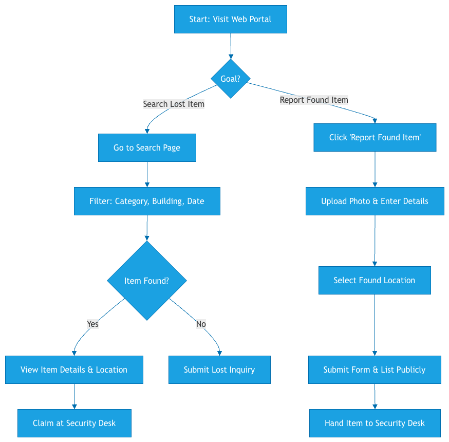
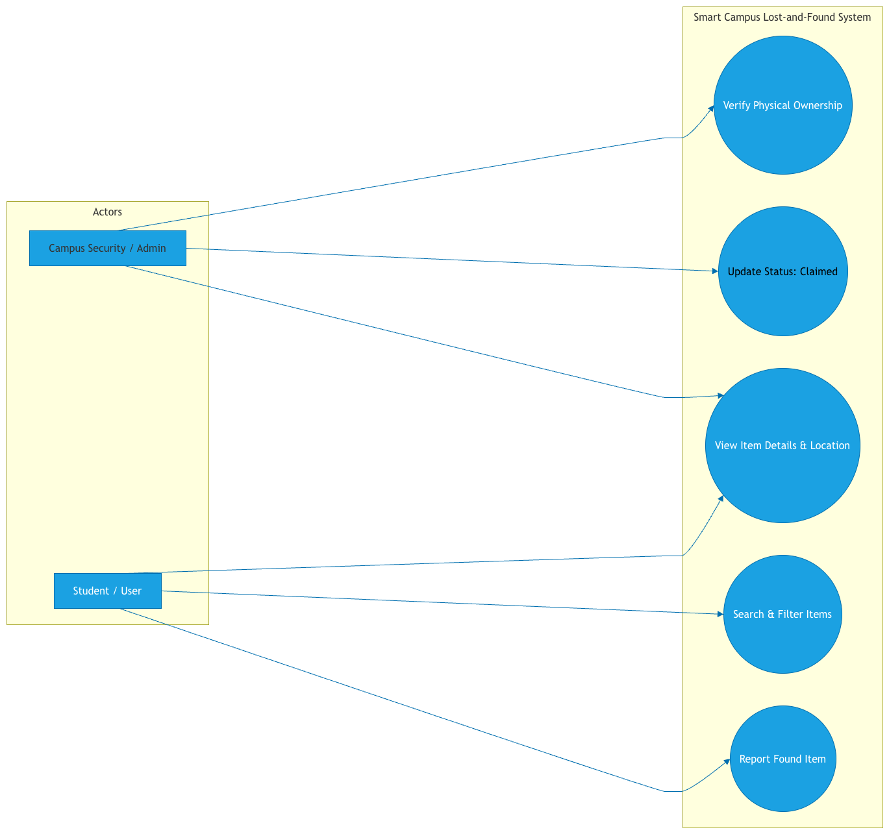

 
# ICT111-SleepyGuys-MVP1

## Course Information

Course Code: ICT111
Course Name: Introduction to Information Technology
Instructor: Dr. Herison Surbakti 

## Team Name

SleepyGuys

## Team Members and Roles

| Student ID | Name | Role | Responsibility |
|---|---|---|---|
| 6702854 | **HTUN NAUNG OO** | Product Lead | Overall team coordination, problem definition, Technical Lead, Docs Lead and project direction |
| 6708563 | **MIN KHANT MAUNG MAUNG** | UX/UI Lead | Design interface screens, wireframes, and user flow |
| 6610464 | **AUNG KHANT ZAYAR OO** | Validation Lead | Manage customer discovery and validation metrics |
| 6709782 | **AUNG HTET THU** | Presentation | Manage repo, prototype feasibility, and documentation |

---

## Venture Overview

## Initial Problem Area

Students frequently lose personal belongings on campus and have difficulty recovering them.

## Target Users

- University Students
- University Staff


### Proposed IT Venture Direction
A centralized **Smart Campus Lost-and-Found Web Platform** where students can quickly report found items, search missing belongings with filtering tools, and securely verify/contact campus staff to claim lost property.

### Technology Stack
* **Frontend:** Responsive Web Application (HTML5, CSS3, JavaScript ES6+, EJS)
* **Backend:** Node.js & Express architecture
* **Features:** Image upload, categorization/filtering system, and status tracking (Lost / Found / Claimed)

---

## Project Journey & Development Progress

###  Lab 01: Team Setup & Structure
* Established team roles, core responsibilities, and internal workflow agreements.
* Initialized standard repository structure (`docs/`, `prototype/`, `data/`, `finance/`, `diagrams/`, `screenshots/`, `pitch/`).

###  Lab 02: Opportunity Scanning & NUF Evaluation
* **Opportunity Scanning:** Evaluated 6 distinct IT solution ideas across campus utility and business domains.
* **Constraint Check:** Filtered out IoT/cybersecurity complexity to focus strictly on feasible web solutions.
* **NUF Evaluation:** Assessed all ideas in `data/opportunity-scoring.csv` using the New, Useful, Feasible framework.
* **Selection Decision:** **Campus Lost-and-Found System** selected as the highest-scoring ($13/15$) and most feasible MVP candidate.

###  Lab 03: Customer Problem Discovery & Evidence Summary
* **Target Respondents:** Defined core respondent profiles in `docs/problem-notes.md` (Students & Security Staff).
* **Non-Leading Questions:** Prepared discovery questions focusing on past behavior and pain points in `docs/customer-questions.md`.
* **Evidence Collection:** Logged response data in `data/raw-responses.csv` to validate problem assumptions.
* **Assumption vs. Evidence:** Mapped team beliefs against user evidence in `docs/assumption-evidence-table.md`.
* **Findings Synthesis:** Summarized validated problem signals and next steps in `docs/customer-discovery-summary.md`.

---

## Lab 04 Documentation
### Problem Statement
Campus students and staff frequently lose belongings but face difficulties locating them due to scattered, unorganized informal chat groups that suffer from message overload.

### Solution Direction
A centralized **Smart Campus Lost-and-Found Web System** allowing users to search categorized listings, upload found item reports, and view clear physical collection points at campus security desks.

---

##  Lab 04: Artifacts Baseline

* **User Target:** Defined user persona baseline (`docs/user-personal.md`)
* **System Requirements:** Established Functional & Non-Functional requirements (`docs/system-requirements.md`)
* **User Stories:** Authored user stories with testable Acceptance Criteria (`docs/user-stories.md`)
* **MVP Scope:** Prioritized core features using MoSCoW framework (`docs/mvp-feature-list.md`)
* **Diagrams:** Integrated User Flow and Use Case diagrams (`diagram/` folder)

### Diagrams



# Smart Campus Lost-and-Found System

**Repository Name:** `ICT111-SleepyGuys-MVP1`

---

##  Venture Overview

### Problem Statement
Campus students and staff frequently lose belongings but face difficulties locating them due to scattered, unorganized informal chat groups that suffer from message overload.

### Solution Direction
A centralized **Smart Campus Lost-and-Found Web System** allowing users to search categorized listings, upload found item reports, and view clear physical collection points at campus security desks.

---

##  Lab 05 Artifacts Baseline (Product Concept & UI/UX Wireframes)

* **Product Concept:** Defined target user, problem, value proposition, and MVP scope boundary (`docs/product-concept.md`).
* **Traceability Matrix:** Mapped all wireframe screens directly to functional system requirements (`docs/feature-requirement-mapping.md`).
* **UI/UX Wireframes:** Designed and exported 6 core system screens with realistic campus data (`wireframes/` directory):
  * `homepage.png` - Portal landing and recent listings preview.
  * `input-form.png` - Found item submission with photo upload.
  * `record-list.png` - Keyword search and multi-category filtering.
  * `detail-view.png` - Detailed item info with security desk claim guidance.
  * `dashboard.png` - Security analytics and metrics summary.
  * `admin-view.png` - Staff management console for updating item statuses.
* **Usability Checklist:** Verified interface consistency and requirement coverage (`docs/wireframe-usability-checklist.md`).

---

##  Repository Structure

```text
ICT111-SleepyGuys-MVP1/
├── docs/                             # Core documentation & requirements
│   ├── product-concept.md            # Target user, value prop, MVP boundary
│   ├── feature-requirement-mapping.md# Requirements-to-screen traceability
│   ├── wireframe-specification.md    # Screen UI/UX specifications
│   ├── wireframe-usability-checklist.md # Interface usability verification
│   ├── user-personal.md              # Target user persona
│   ├── system-requirements.md        # System functional/non-functional specs
│   ├── user-stories.md               # User stories & acceptance criteria
│   ├── mvp-feature-list.md           # MoSCoW feature prioritization
│   └── weekly-logbook.md             # Progress logs & decisions
├── wireframes/                       # Lab 05 UI/UX Wireframe Screenshots
│   ├── homepage.png
│   ├── input-form.png
│   ├── record-list.png
│   ├── detail-view.png
│   ├── dashboard.png
│   └── admin-view.png
├── diagram/                          # System diagrams
│   ├── user-flow.png                 # User interaction flow
│   └── use-case-diagram.png          # Use case diagram
├── data/                             # Research data & discovery logs
├── prototype/                        # Web application source files
└── README.md                         # Project landing page & progress tracker
