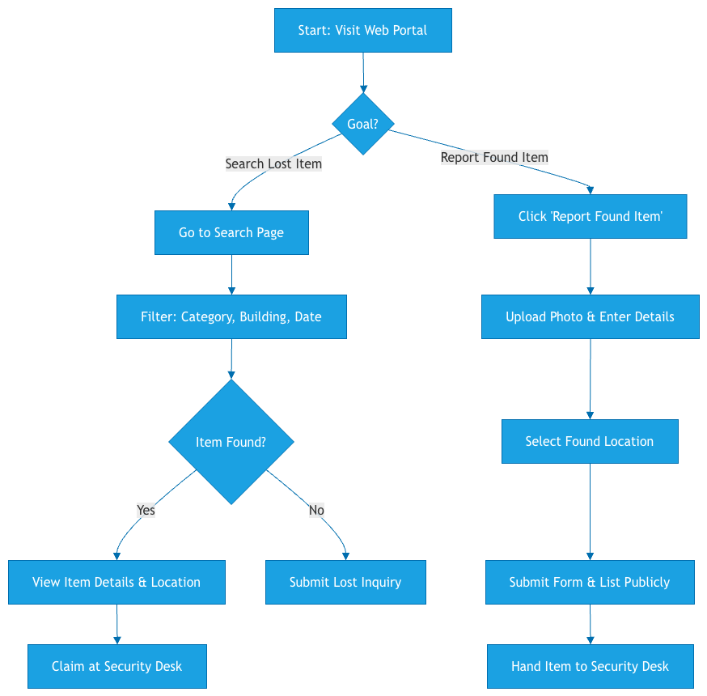
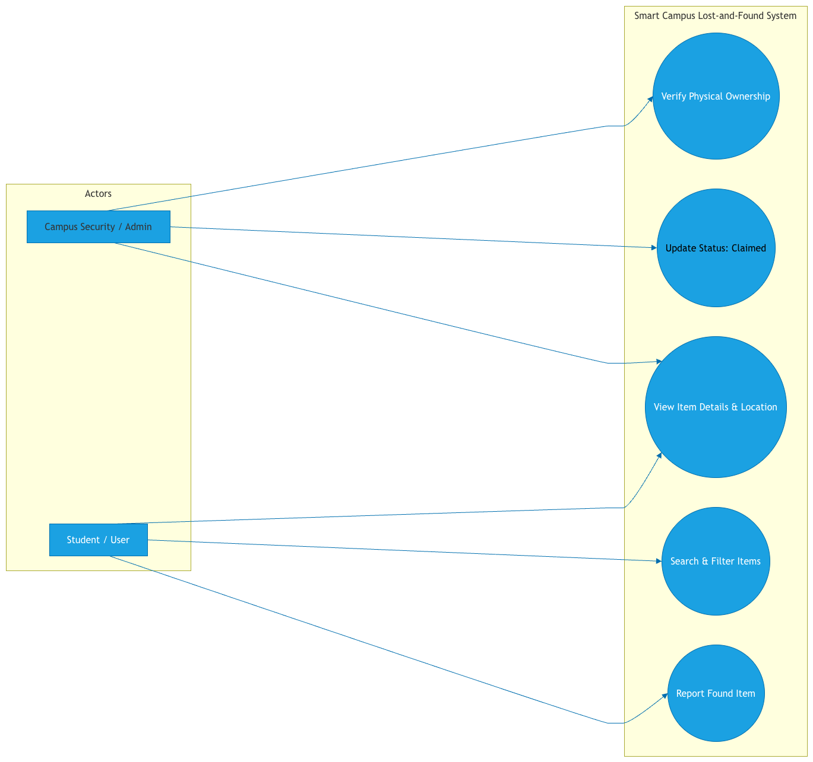

 
# ICT111-SleepyGuys-MVP1

## Course Information

Course Code: ICT111
Course Name: Introduction to Information Technology
Instructor: Dr. Herison Surbakti 

## Team Name

SleepyGuys

## Team Members and Roles

| Student ID | Name | Role | Responsibility |
|---|---|---|---|
| 6702854 | **HTUN NAUNG OO** | Product Lead | Overall team coordination, problem definition, Technical Lead, Docs Lead and project direction |
| 6708563 | **MIN KHANT MAUNG MAUNG** | UX/UI Lead | Design interface screens, wireframes, and user flow,Power BI |
| 6610464 | **AUNG KHANT ZAYAR OO** | Validation Lead | Manage customer discovery and validation metrics |
| 6709782 | **AUNG HTET THU** | Presentation | Manage report, prototype feasibility, and documentation |

---

## Venture Overview

## Initial Problem Area

Students frequently lose personal belongings on campus and have difficulty recovering them.

## Target Users

- University Students
- University Staff

### Proposed IT Venture Direction
A centralized **Smart Campus Lost-and-Found Web Platform** where students can quickly report found items, search missing belongings with filtering tools, and securely verify/contact campus staff to claim lost property.

### Technology Stack
* **Frontend:** Responsive Web Application (HTML5, CSS3, JavaScript ES6+, EJS)
* **Backend:** Node.js & Express architecture
* **Features:** Image upload, categorization/filtering system, and status tracking (Lost / Found / Claimed)

---

## Project Journey & Development Progress

###  Lab 01: Team Setup & Structure
* Established team roles, core responsibilities, and internal workflow agreements.
* Initialized standard repository structure (`docs/`, `prototype/`, `data/`, `finance/`, `diagrams/`, `screenshots/`, `pitch/`).

###  Lab 02: Opportunity Scanning & NUF Evaluation
* **Opportunity Scanning:** Evaluated 6 distinct IT solution ideas across campus utility and business domains.
* **Constraint Check:** Filtered out IoT/cybersecurity complexity to focus strictly on feasible web solutions.
* **NUF Evaluation:** Assessed all ideas in `data/opportunity-scoring.csv` using the New, Useful, Feasible framework.
* **Selection Decision:** **Campus Lost-and-Found System** selected as the highest-scoring ($13/15$) and most feasible MVP candidate.

###  Lab 03: Customer Problem Discovery & Evidence Summary
* **Target Respondents:** Defined core respondent profiles in `docs/problem-notes.md` (Students & Security Staff).
* **Non-Leading Questions:** Prepared discovery questions focusing on past behavior and pain points in `docs/customer-questions.md`.
* **Evidence Collection:** Logged response data in `data/raw-responses.csv` to validate problem assumptions.
* **Assumption vs. Evidence:** Mapped team beliefs against user evidence in `docs/assumption-evidence-table.md`.
* **Findings Synthesis:** Summarized validated problem signals and next steps in `docs/customer-discovery-summary.md`.

---

# README Update - Lab 04

## Lab 04: User Persona, Requirements, and User Stories

### Primary Target User
The primary target users of our Smart Campus Lost-and-Found System are **University Students** who frequently lose or find personal items on campus, as well as **Campus Security Staff** responsible for managing and verifying lost-and-found claims.

### Persona Summary
- **Persona name:** Min Thuta (Campus Student) & U Ba Maung (Security Officer)
- **User type:** Student / Campus Staff
- **Main goal:** Quickly report found items, search for lost personal belongings, and streamline the claim verification process.
- **Main pain point:** High friction in physical reporting, lack of immediate visual proof/photo attachments, and slow status tracking.
- **Current workaround:** Asking around in social media groups or manually visiting the physical security office.

### Key Requirements
| Req ID | Requirement | Priority | Related Evidence |
|---|---|---|---|
| FR-1.1 | The system shall allow users to upload item photos when submitting a lost/found report. | Must | Validated in Lab 08 (`User_01`, `User_07`) |
| FR-1.2 | The system shall validate required location tags for found items. | Must | Identified issue in Lab 08 (`User_05`) |
| FR-2.2 | The system shall provide a search bar and category filter dropdown. | Must | Tested in Lab 08 (`User_02`, `User_06`) |
| FR-3.1 | The system shall display security desk location and pickup hours. | High | Validated in Lab 08 (`User_03`) |
| FR-3.2 | The system shall allow security staff to update item status to 'Claimed'. | Must | Tested in Lab 08 (`User_04`, `User_08`) |
| NFR-01 | The user interface shall load search results within 2 seconds. | Must | Performance tested in Lab 08 |

### MVP Feature Scope
| Feature | Priority | Included in Final Prototype? |
|---|---|---|
| Found Item Photo Upload | Must | Yes |
| Keyword Search & Category Filter | Must | Yes |
| Security Desk Map & Location Info | High | Yes |
| Claim Status Update Console (Admin) | Must | Yes |

### Diagram Links
- **User flow diagram:** `/docs/diagrams/user-flow.png`
- **Use case diagram:** `/docs/diagrams/use-case.png`

### GitHub Contribution Evidence
All group members (ICT111 - Sleepy Guys) contributed to this repository through commits, issues, feature implementations, and documentation updates.

### Diagrams

---

# README Update - Lab 05

## Lab 05: Product Concept and UI/UX Wireframe

### Product Concept
Our product, **Smart Campus Lost-and-Found System**, is a centralized digital web application designed for university students and security staff. It solves the issue of missing belongings on campus by offering instant photo upload reporting, interactive map/location tagging, fast keyword filtering, and an automated claim status management dashboard.

### Requirement-Driven Screens
List of core screens designed based on our system requirements and validated in Lab 08 testing:

| Screen | Related Requirement IDs | Wireframe File |
|---|---|---|
| Homepage / Landing Page | FR-2.2, FR-3.1 | `/wireframes/homepage.png` |
| Found Item Submission Form | FR-1.1, FR-1.2 | `/wireframes/input-form.png` |
| Search & Lost Items List | FR-2.2 | `/wireframes/record-list.png` |
| Item Detail & Location View | FR-1.2, FR-3.1 | `/wireframes/detail-view.png` |
| Customer Validation Dashboard | FR-1.1, FR-3.2 | `/wireframes/dashboard.png` |
| Admin / Security Action Console | FR-3.2 | `/wireframes/admin-view.png` |

### User Flow
Users start at the Homepage where they can choose to either report a found item or search for a lost item. 

1. **Found Item Flow:** User fills in details $\rightarrow$ attaches photo (`FR-1.1`) $\rightarrow$ selects location tag (`FR-1.2`) $\rightarrow$ submits report.
2. **Search Lost Item Flow:** User searches by keyword/category (`FR-2.2`) $\rightarrow$ views item details & security desk location (`FR-3.1`) $\rightarrow$ claims item at security desk.
3. **Security Admin Flow:** Security staff log into the Console $\rightarrow$ verify claim $\rightarrow$ update item status to 'Claimed' (`FR-3.2`).

- **User Flow Diagram Link:** `/diagrams/user-flow.png`

### Team Contribution
All group members (ICT111 - Sleepy Guys) contributed to wireframe design, workflow mapping, requirement linking, and documentation updates in this shared GitHub repository.

##  Lab 06: Business Model & Technical Architecture

###  Documentation Links
-  [Business Model Canvas](docs/business-model-canvas.md)
-  [Feature-Value Mapping Matrix](docs/feature-value-mapping.md)
-  [Technical Architecture & Stack Selection](docs/technical-architecture.md)
-  [Data Structure & Entity Specification](docs/data-structure.md)
-  [Sample Records Dataset](data/sample-records.csv)
-  [Weekly Logbook](docs/weekly-logbook.md)

## Artifacts Baseline (Business Model & Technical Architecture)

* **Business Model Canvas:** Defined all 9 BMC blocks specific to campus lost & found operations (`docs/business-model-canvas.md`).
* **Feature-Value Mapping:** Mapped system features directly to user/business value and requirements (`docs/feature-value-mapping.md`).
* **Technical Architecture:** Selected database-backed web application architecture using Node.js & Express (`docs/technical-architecture.md`).
* **Data Structure:** Specified logical entities (`ItemRecord`, `SecurityDeskOffice`) and field validations (`docs/data-structure.md`).
* **Sample Dataset:** Created baseline CSV dataset for testing (`data/sample-records.csv`).
##  Lab 07 Artifacts Baseline (MVP Experiment Design)

* **Critical Assumptions:** Identified and ranked top risky assumptions using a Risk Matrix (`docs/critical-assumptions.md`).
* **MVP Experiment Plan:** Outlined prototype testing scope and mapped screens to requirement IDs (`docs/mvp-experiment-plan.md`).
* **Tester Script:** Prepared standardized task flows for student and security staff persona testing (`docs/demo-script.md`).
* **Success Metrics:** Defined measurable thresholds for task completion rate and duration (`docs/acquisition-metrics.md`).
* **Feedback Questionnaire:** Created neutral post-experiment feedback questions (`docs/feedback-form.md`).

---
# README Update - Lab 08

## Lab 08: Customer Validation and Analytics Sheet

### Validation Objective
The objective of this lab was to evaluate the core user workflows of our Smart Campus Lost-and-Found System MVP (`v1.0-EJS`). We tested item reporting, searching, and status management with real target users (Students and Security Staff) to collect empirical evidence, measure usability metrics, and inform our MVP prototype decision.

### Prototype Version Tested
- **Version:** `v1.0-EJS`
- **Link:** [Link to MVP Demo / Repository]
- **Screenshots:** `/screenshots/lab08-powerbi-dashboard.png`

### Analytics Summary
| Metric | Result |
|---|---:|
| Total test users | 8 |
| Task success rate | 87.5% |
| Average feedback score | 4.12 / 5.00 |
| Average interest level | 4.38 / 5.00 |
| Main confusion point | Location Field Tagging & Category Filter Dropdown |

### MVP Decision
**Partially Validated (Revise Before Implementation)**  
The team will revise the prototype based on user feedback before moving into full implementation. While high interest (4.38/5) and task success (87.5%) validate strong demand, key improvements are required for location input validation (`FR-1.2`), category filter contrast (`FR-2.2`), and security action buttons (`FR-3.2`).

### Files Added
- `/data/validation-results.xlsx`
- `/data/validation-results.csv`
- `/docs/customer-validation-summary.md`
- `/docs/analytics-insights.md`
- `/docs/mvp-decision.md`
- `/screenshots/lab08-powerbi-dashboard.png`
- `/docs/weekly-logbook.md`
